# ProgettoGep

# TITOLO
    Subly

# DESCRIZIONE
  Prendi il controllo delle tue finanze con [Nome App]. Un'interfaccia intuitiva per monitorare ogni abbonamento attivo, analizzare lo storico dei costi e gestire le scadenze in un unico posto. Ottimizza le tue spese e accedi direttamente ai servizi per rinnovare o cancellare i tuoi piani in un click.

# PROBLEMA
  "Risolve il problema di abbonamenti 
  dimenticati e della gestione dei soldi, 
  problemi abbatstanza comuni tra le persone"

# TARGET
  "Individui che fanno grande
   uso di abbonamenti"

# COMPETITORS
  Rocket Money
  TrackMySubs
  Dyme

# ANALISI

| Caratteristica | Importanza | 💎 Subly | 🚀 Rocket Money | 📈 TrackMySubs | 💶 Dyme |
| :--- | :---: | :--- | :--- | :--- | :--- |
| **Tracciamento Costi Totali** | 🔥 High | **Disponibile** | Disponibile | Parziale | Disponibile |
| **Accesso Diretto ai Portali** | 🔥 High | **Integrato** | No (Servizio esterno) | No | Parziale |
| **Privacy & Controllo Dati** | 🔥 High | **Alta (No Bank Link)** | Bassa (Richiede conto) | Alta | Bassa |
| **Facilità d'uso (UI/UX)** | 🔥 High | **Moderna** | Eccellente | Datata | Buona |
| **Costi del Servizio** | 🔥 High | **Freemium** | Premium ($$$) | Freemium | Premium |
| **Analisi Risparmio** | 🟡 Moderate | **Semplificata** | Avanzata | Assente | Avanzata |

# TAGLINE
  "Subly: Meno stress da rinnovo, più consapevolezza di spesa."
  
  
# TIMESTAMP JWT
  1758872755

---

# TECNOLOGIE

Per garantire velocità, sicurezza e un'esperienza utente fluida, **Subly** è stato sviluppato utilizzando le seguenti tecnologie:

* **Frontend:** `React.js` + `Tailwind CSS`  
    *Interfaccia moderna e responsiva, ottimizzata per la visualizzazione dei costi su qualsiasi dispositivo.*
* **Backend:** `Node.js` + `Express`  
    *Architettura API REST efficiente per la gestione della logica applicativa e delle query.*
* **Database:** `MongoDB` (o SQLite)  
    *Struttura flessibile per la memorizzazione dei dati degli abbonamenti e dello storico delle spese.*
* **Autenticazione:** `JWT (JSON Web Token)`  
    *Sistema sicuro per la gestione delle sessioni utente e protezione dei dati sensibili.*
* **Sicurezza:** `Bcrypt`  
    *Crittografia avanzata per il salvataggio delle password e comunicazioni protette.*
* **Versioning:** `Git` + `GitHub`  
    *Controllo di versione rigoroso per il tracciamento dello sviluppo e la collaborazione.*

---  

# REQUISITI

###  Requisiti Funzionali
Il sistema permette all'utente di gestire centralmente i propri abbonamenti attraverso le seguenti funzionalità:
 **Gestione Account:** Registrazione, login sicuro e recupero credenziali.
 **Dashboard Abbonamenti:** Inserimento, modifica e rimozione dei servizi attivi (es. piattaforme streaming, software, utility).
 **Controllo Finanziario:** Calcolo automatico dei costi periodici e analisi della spesa totale accumulata dall'attivazione.
 **Monitoraggio Scadenze:** Visualizzazione chiara delle date di rinnovo e dei giorni rimanenti.
 **Operatività Rapida:** Link diretti ai portali ufficiali per gestire rapidamente disdette o rinnovi.

###  Requisiti Non Funzionali
Per garantire un'esperienza d'uso ottimale, l'applicazione segue questi standard:
 **User Experience (UX):** Interfaccia semplice ed intuitiva per massimizzare la chiarezza dei dati.
 **Performance & Disponibilità:** Tempi di risposta rapidi e disponibilità continua del servizio.
 **Design Responsivo:** Compatibilità multipiattaforma (Desktop, Tablet e Mobile).
 **Privacy-First:** Gestione dei dati basata sull'input dell'utente, senza necessità di collegamenti diretti a conti bancari esterni.

###  Requisiti di Dominio
Le regole di business che governano la logica dell'applicazione:
 **Flessibilità di Fatturazione:** Supporto a diversi cicli di pagamento (settimanale, mensile, annuale).
 **Sicurezza dei Dati:** Protezione delle informazioni sensibili tramite standard di crittografia moderni.
 **Trasparenza:** Ogni dato finanziario visualizzato deve essere riconducibile alla cronologia dei pagamenti inseriti.

## USER STORY

Le funzionalità di **Subly** sono state progettate mettendo l'utente al centro del processo. Ecco i principali scenari d'uso:

###  Per l'Utente Standard
* **Monitoraggio Spese:** > *In quanto utente,* voglio inserire il costo e la frequenza di ogni mio abbonamento, *così da* avere un quadro chiaro di quanto spendo ogni mese.
* **Storico Pagamenti:** > *In quanto utente,* voglio vedere il totale dei costi accumulati dalla data di attivazione, *così da* rendermi conto dell'impatto economico a lungo termine di ogni servizio.
* **Gestione Scadenze:** > *In quanto utente,* voglio visualizzare una lista ordinata per data di scadenza, *così da* non dimenticarmi dei rinnovi imminenti ed evitare addebiti indesiderati.
* **Azione Rapida:** > *In quanto utente,* voglio poter cliccare su un tasto che mi porti direttamente alla pagina di disdetta del servizio, *così da* non perdere tempo a cercare le impostazioni nel sito del fornitore.

### Sicurezza e Accesso
* **Privacy e Controllo:** > *In quanto utente attento alla privacy,* voglio poter inserire i miei dati manualmente senza collegare il mio conto bancario reale, *così da* mantenere il pieno controllo sulle mie informazioni finanziarie.
* **Accesso Protetto:** > *In quanto utente,* voglio accedere tramite password crittografata, *così da* essere sicuro che solo io possa visualizzare la mia lista di abbonamenti.

### Per l'Amministratore (Admin)
* **Gestione Catalogo:** > *In quanto amministratore,* voglio poter aggiungere nuovi template di abbonamenti predefiniti (es. loghi e link di Netflix, Disney+, Spotify), *così da* rendere l'inserimento più veloce per gli utenti.

# UML USE CASE

# SITO LOVABLE

[[subly-buddy.lovable.app](https://subly-buddy.lovable.app)]

# ELEVATOR PITCH

sono Michele, fondatore di Subly, un’applicazione pensata per risolvere un problema sempre più diffuso: la gestione disordinata degli abbonamenti digitali. Oggi ognuno di noi paga più servizi in abbonamento (streaming, musica, software, palestre, utility)  ma spesso perdiamo il controllo delle scadenze e del costo totale mensile, finendo per spendere soldi inutilmente. Subly nasce per centralizzare tutto in un’unica dashboard semplice e intuitiva, dove l’utente può inserire i propri abbonamenti, visualizzare i costi periodici, monitorare le date di rinnovo e accedere rapidamente ai siti ufficiali per gestire o disdire il servizio. Operiamo nel mercato in forte crescita della gestione finanziaria personale digitale, trainato dall’aumento costante dei servizi in abbonamento e dalla crescente attenzione al risparmio. Il nostro modello di business prevede una versione gratuita per la gestione base e una versione Premium con funzionalità avanzate di analisi delle spese, notifiche intelligenti e possibili partnership o affiliazioni con servizi terzi. Dal punto di vista tecnologico, Subly è sviluppata con un’architettura scalabile e un’interfaccia user-friendly, progettata per offrire semplicità, chiarezza e controllo totale all’utente. Rispetto ai competitor come Rocket Money o altre app di subscription tracking, Subly si distingue per la sua immediatezza, la centralizzazione completa e il focus sull’esperienza utente. Il nostro obiettivo è crescere progressivamente introducendo funzionalità sempre più evolute. Subly vuole trasformare il modo in cui le persone gestiscono i propri abbonamenti, rendendo il controllo delle spese più semplice, trasparente e intelligente.

**Slide 1: The Opening Slide**
Subly è il progetto di Finanza Personale focalizzato sulla gestione intelligente degli abbonamenti digitali, il software nasce con l'obiettivo di restituire all'utente il controllo totale sulle proprie spese ricorrenti attraverso lo slogan: "Prendi il controllo, smetti di subire i tuoi abbonamenti."

**Slide 2: The Problem**
Oggi la gestione delle finanze digitali è diventata estremamente complessa a causa della frammentazione dei servizi. La "Subscription Fatigue" porta gli utenti a dimenticare rinnovi, ignorare aumenti di prezzo e perdere traccia degli addebiti mensili. Questo caos finanziario genera uno spreco silenzioso di centinaia di euro ogni anno per servizi inutilizzati o dimenticati.

**Slide 3: The Solution**
Subly risponde a questa esigenza offrendo un hub centralizzato per il monitoraggio delle spese. L'applicazione non si limita a elencare i costi, ma analizza l'impatto economico totale dall'attivazione del servizio e fornisce link diretti alle pagine di gestione dei fornitori. In questo modo, l'utente può decidere di rinnovare o disdire un abbonamento con un unico click, eliminando ogni barriera burocratica.

**Slide 4: Market Size**
Il mercato della Subscription Economy ha raggiunto un valore globale di 650 miliardi di dollari. Con una media di dieci abbonamenti attivi per utente, Subly si posiziona nel settore strategico del Personal Finance Management. Questo comparto è in rapida espansione grazie alla crescente digitalizzazione dei pagamenti e alla necessità dei consumatori di ottimizzare il proprio budget mensile.

**Slide 5: Business Model**
Il modello di business si basa su una strategia Freemium. La versione base gratuita garantisce l'accesso al tracciamento e ai promemoria, mentre la versione Pro genera ricavi tramite un abbonamento che sblocca analisi predittive avanzate, esportazione dei dati in formato professionale e la gestione di account multipli per nuclei familiari.

**Slide 6: Proprietary Technology**
L'infrastruttura tecnologica utilizza React per un frontend reattivo e Node.js per un backend scalabile. La sicurezza è garantita da protocolli di crittografia Bcrypt e gestione delle sessioni tramite JWT. Il vero valore aggiunto è rappresentato dal Deep-Linking Engine, un database proprietario che mappa i percorsi diretti verso le sezioni di disdetta dei principali provider mondiali.

**Slide 7: Competition**
Nonostante la presenza di competitor come Rocket Money o Dyme, il mercato attuale è polarizzato tra app troppo complesse o servizi che richiedono l'accesso intrusivo ai dati bancari. Subly si distingue per un approccio radicalmente diverso, offrendo uno strumento potente ma rispettoso della riservatezza dei dati dell'utente.

**Slide 8: Why is Subly better?**
La superiorità di Subly risiede nel principio Privacy-First, poiché non obbliga l'utente a collegare il proprio conto corrente. L'interfaccia è studiata per ridurre il carico cognitivo, mentre la funzione esclusiva del calcolo del costo storico totale permette una consapevolezza finanziaria che i competitor tradizionali tendono a nascondere per non scoraggiare il consumo.

**Slide 9: Customer Acquisition**
La crescita della piattaforma è affidata a una strategia di App Store Optimization mirata e al Content Marketing incentrato sul risparmio consapevole. Un programma di Referral interno incentiva inoltre la diffusione virale dell'app, premiando gli utenti che aiutano la community a espandersi e a mappare nuovi servizi digitali.

**Slide 10: Founding Team**
Il progetto è ideato e sviluppato integralmente da [Tuo Nome], nel ruolo di Founder e Lead Developer, con una visione chiara sulla democratizzazione degli strumenti finanziari.

**Slide 11: Money, Milestones**
L'obiettivo per il primo anno è il raggiungimento di cinquemila utenti attivi e la mappatura completa di oltre cinquecento servizi internazionali. Grazie a una struttura di costi infrastrutturali estremamente ridotta, il punto di pareggio è previsto entro i primi diciotto mesi di attività, aprendo la strada a future integrazioni con sistemi di pagamento smart.

# WBS

```mermaid
graph TD
    A["Subly - Gestione Abbonamenti (60k - 5 Mesi)"] --> B["Pianificazione e Analisi (3 sett.)"]
    A --> C["Design UI/UX (4 sett.)"]
    A --> D["Sviluppo Frontend (6 sett.)"]
    A --> E["Sviluppo Backend (6 sett.)"]
    A --> F["Pagamenti e Sicurezza (3 sett.)"]
    A --> G["Testing e QA (3 sett.)"]
    A --> H["Marketing e Lancio (2 sett.)"]
    A --> I["Supporto e Manutenzione (2 sett.)"]

    B --> B1["Analisi Requisiti"]
    B --> B2["Analisi Competitor"]
    B --> B3["Definizione MVP"]
    B --> B4["Pianificazione Tecnica"]

    C --> C1["Wireframe Dashboard"]
    C --> C2["Prototipo Gestione Abbonamenti"]
    C --> C3["User Testing"]

    D --> D1["Login e Registrazione"]
    D --> D2["Dashboard Abbonamenti"]
    D --> D3["CRUD Abbonamenti"]
    D --> D4["Responsive Design"]

    E --> E1["API Utenti"]
    E --> E2["API Abbonamenti"]
    E --> E3["Database"]
    E --> E4["Sistema Notifiche"]

    F --> F1["Gateway Bancario"]
    F --> F2["Autenticazione JWT"]
    F --> F3["Crittografia Password"]

    G --> G1["Test Funzionali"]
    G --> G2["Bug Fixing"]
    G --> G3["Test Sicurezza"]

    H --> H1["Landing Page"]
    H --> H2["Campagne Social"]
    H --> H3["Pubblicazione MVP"]

    I --> I1["Monitoraggio Server"]
    I --> I2["Nuove Feature"]
```

