# ProgettoGep

# TITOLO
    Subly

# DESCRIZIONE
  Prendi il controllo delle tue finanze con [Nome App]. Un'interfaccia intuitiva per monitorare ogni abbonamento attivo, analizzare lo storico dei costi e gestire le scadenze in un unico posto. Ottimizza le tue spese e accedi direttamente ai servizi per rinnovare o cancellare i tuoi piani in un click.

# PROBLEMA
  "Risolve il problema di abbonamenti 
  dimenticati e della gestione dei soldi, 
  problemi abbatstanza comuni tra le persone"

# TARGET
  "Individui che fanno grande
   uso di abbonamenti"

# COMPETITORS
  Rocket Money
  TrackMySubs
  Dyme

# ANALISI
   Caratteristica	Importanza	💎 Subly (Tua App)	🚀 Rocket Money	📈 TrackMySubs	💶 Dyme	
Tracciamento Costi Totali	🔥 High	Disponibile (Storico completo dall'attivazione)	Disponibile	Solo previsione mensile/annuale	Disponibile	
Accesso Diretto ai Portali	🔥 High	Integrato (Link rapidi per rinnovo/disdetta)	No (Usa un servizio concierge)	No	Parziale	
Privacy & Controllo Dati	🔥 High	Massima (Nessun collegamento bancario richiesto)	Bassa (Richiede accesso al conto)	Alta (Inserimento manuale)	Bassa (Richiede accesso al conto)	
Facilità d'uso (UI/UX)	🔥 High	Moderna e Intuitiva	Eccellente	Datata (Stile Web 2.0)	Buona	
Promemoria Scadenze	🔥 High	Personalizzabili	Standard	Avanzati	Standard	
Costi del Servizio	🔥 High	Gratis / Open Source	Premium ($7-12/mese)	Freemium (Limitato)	Premium (per funzioni extra)	
Analisi Risparmio	🟡 Moderate	Semplificata	Molto avanzata	Assente	Avanzata	

# TAGLINE
  "Basta abbonamenti 
  dimenticati, gestiscili tutti 
  da una singola interfaccia"
  
  

# TIMESTAMP JWT
  1758872755

# UML USE CASE

# SITO LOVABLE

[subly-buddy.lovable.app](https://subly-buddy.lovable.app)

# ELEVATOR PITCH

sono Michele, fondatore di Subly, un’applicazione pensata per risolvere un problema sempre più diffuso: la gestione disordinata degli abbonamenti digitali. Oggi ognuno di noi paga più servizi in abbonamento (streaming, musica, software, palestre, utility)  ma spesso perdiamo il controllo delle scadenze e del costo totale mensile, finendo per spendere soldi inutilmente. Subly nasce per centralizzare tutto in un’unica dashboard semplice e intuitiva, dove l’utente può inserire i propri abbonamenti, visualizzare i costi periodici, monitorare le date di rinnovo e accedere rapidamente ai siti ufficiali per gestire o disdire il servizio. Operiamo nel mercato in forte crescita della gestione finanziaria personale digitale, trainato dall’aumento costante dei servizi in abbonamento e dalla crescente attenzione al risparmio. Il nostro modello di business prevede una versione gratuita per la gestione base e una versione Premium con funzionalità avanzate di analisi delle spese, notifiche intelligenti e possibili partnership o affiliazioni con servizi terzi. Dal punto di vista tecnologico, Subly è sviluppata con un’architettura scalabile e un’interfaccia user-friendly, progettata per offrire semplicità, chiarezza e controllo totale all’utente. Rispetto ai competitor come Rocket Money o altre app di subscription tracking, Subly si distingue per la sua immediatezza, la centralizzazione completa e il focus sull’esperienza utente. Il nostro obiettivo è crescere progressivamente introducendo funzionalità sempre più evolute. Subly vuole trasformare il modo in cui le persone gestiscono i propri abbonamenti, rendendo il controllo delle spese più semplice, trasparente e intelligente.

# WBS

```mermaid
graph TD
    A["Subly - Gestione Abbonamenti (60k - 5 Mesi)"] --> B["Pianificazione e Analisi (3 sett.)"]
    A --> C["Design UI/UX (4 sett.)"]
    A --> D["Sviluppo Frontend (6 sett.)"]
    A --> E["Sviluppo Backend (6 sett.)"]
    A --> F["Pagamenti e Sicurezza (3 sett.)"]
    A --> G["Testing e QA (3 sett.)"]
    A --> H["Marketing e Lancio (2 sett.)"]
    A --> I["Supporto e Manutenzione (2 sett.)"]

    B --> B1["Analisi Requisiti"]
    B --> B2["Analisi Competitor"]
    B --> B3["Definizione MVP"]
    B --> B4["Pianificazione Tecnica"]

    C --> C1["Wireframe Dashboard"]
    C --> C2["Prototipo Gestione Abbonamenti"]
    C --> C3["User Testing"]

    D --> D1["Login e Registrazione"]
    D --> D2["Dashboard Abbonamenti"]
    D --> D3["CRUD Abbonamenti"]
    D --> D4["Responsive Design"]

    E --> E1["API Utenti"]
    E --> E2["API Abbonamenti"]
    E --> E3["Database"]
    E --> E4["Sistema Notifiche"]

    F --> F1["Gateway Bancario"]
    F --> F2["Autenticazione JWT"]
    F --> F3["Crittografia Password"]

    G --> G1["Test Funzionali"]
    G --> G2["Bug Fixing"]
    G --> G3["Test Sicurezza"]

    H --> H1["Landing Page"]
    H --> H2["Campagne Social"]
    H --> H3["Pubblicazione MVP"]

    I --> I1["Monitoraggio Server"]
    I --> I2["Nuove Feature"]
```

